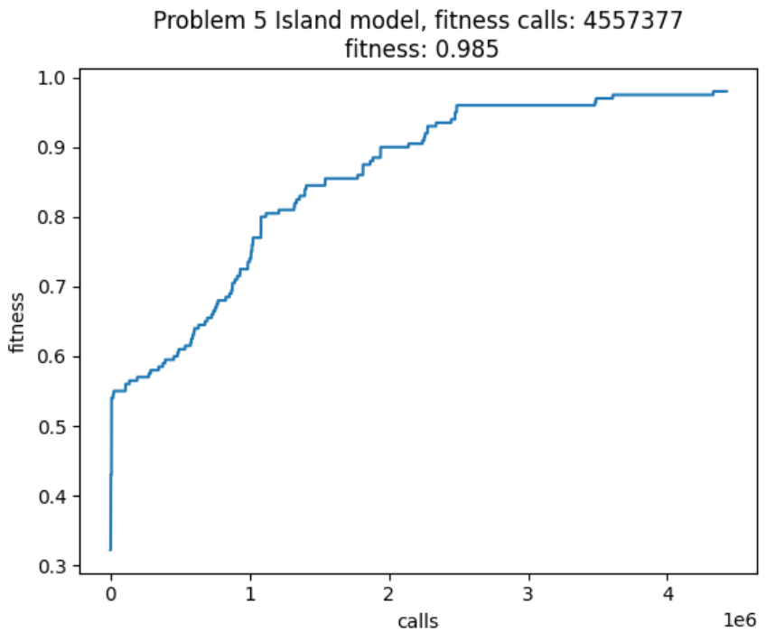

# Computational Intelligence - Laboratory 9
The objective of the laboratory was to write a local-search algorithm (eg. an EA) able to solve the *Problem* instances 1, 2, 5, and 10 on a 1000-loci genomes, using a minimum number of fitness calls.

## Collaborations
The laboratory has been carried out with Laura Amoroso (s313813)

## Execution
In order to solve the given problem we have tried to set simple GA and GA with Island model to introduce diversity and avoid premature convergence.

GA has been implemented in one of its standard versions, including some parameter tuning in order to find the best mutation probability.

Island model has been implemented in order to force exploration and to avoid premature convergence. The islands have been created splitting the entire population and applying different cross-over methods between each other. Individuals have been exchanged between islands with a low migrating probability.

Moreover to introduce some noise, in some cases individuals have been migrated randomly, while in others the migrants have been selected between the fittest.

Duplicated individuals have been removed during the offspring's generation.

Since the problem required to minimize the number of fitness calls, the island model does not lead to improvements for problem size 1 or 2 since a simple GA was already sufficient to solve the problems. For the higher problem size, as seen, GA have an higher tendency to prematurely converge.

Island models thus provide an efficient mechanism to increase diversity leading to better results.

Parameter tuning has been implemented in island model too, in order to adapt migration and mutation probability. 

## Results
To solve problem of size 1 and 2 and try to minimize fitness calls we used the one cut cross-over and a starting mutation probability of 0.15.

Problem size 1:

Problem size 2:

The same approach turned out to be not suitable for more complex instances of the problem.

Problem size 5 - GA:

Problem size 5 - GA:

Therefore, as previously described, we decided to implement an island model that preserves diversity and this allowed us to overcome the stalemates encountered with GA.

The best parameters are: ALL_POPULATION_SIZE = 300 TOURNAMENT_SIZE = 2 MUTATION_PROBABILITY = 0.01 MIGRATION_PROBABILITY=0.01 LOCI=1000 num_islands=5 POPULATION_SIZE=ALL_POPULATION_SIZE//num_islands OFFSPRING_SIZE =POPULATION_SIZE//3 is_removing=False num_migrants=10

### Extra method: Hill climbing - Steepest Ascent version combined with random mutation
We laslty tried to implement an hill climbing algorithm hoping that it could perform better results than the GA for the bit-string problem proposed. 
The results unfortunately did not improved.

## References
Links consulted for the realization of the lab:

[What makes a problem hard for a genetic algorithm?](https://link.springer.com/article/10.1007/BF00993046)

[Exploiting co-evolution and a modified island model to climb the Core War hill](https://ieeexplore.ieee.org/document/1299947)

[Localized Island Model Genetic Algorithm in Population Diversity Preservation](https://www.researchgate.net/publication/321795647_Localized_Island_Model_Genetic_Algorithm_in_Population_Diversity_Preservation)
